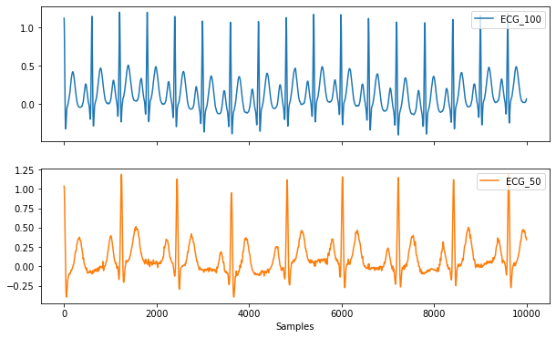

## Project background

### Purpose of project

Eine Software zur überprüfung und Darstellung Patienabhängiger Leistungsdaten. Die Analyse wird anhand eines Leistungstests am Ergometer durchgeführt. 

### Scope of project

Die Software ist auf jedes Fitnesslevel der Probanden anwendbar und dient zur überprüfung der Vitalparameter unter Anstrengung. Die Vitalparameter werden mit passenden Messgeräten aufgezeichnet. Die Schwierigkeitsstufe wird dabei auf den jeweiligen Probanden individuell eingestellt.
### Other background information

Das System soll eine korrekte Datenverarbeitung gewährleisten.

## Perspectives
### Who will use the system?

Kann von Diagnostikern Therapeuten oder Ärzten sowohl für Rehabilitations- als auch Trainingszwecke für ihre Patienten verwendet werden.

### Who can provide input about the system?

Personen die mit der Auswertung der dargestellten Daten arbeiten oder mit der Auswertung beschäftigt sind. Erfahrungen während der Nutzung können zur verbesserung der Software beitragen. 

## Project Objectives
### Known business rules

t.b.t

### System information and/or diagrams

Beispiel von aufgezeichneten EKG Daten

Aus diesem muss die Herzrate bestimmt werden.

### Assumptions and dependencies

Ein auf den Patienten angepasster Schwierigkeitsgrad muss verwendet werden, um die Funktion des Tests zu gewährleisten. Eine richtige Anwendung der Messinstrumente ist erforderlich.

### Design and implementation constraints

Ein einfach zu bedienendes Benutzer-Interface.

## Risks

Bei nicht korrekt angepasstem Schwierigkeitsgrades kann es zu einer Überanstrengung des Patienten führen 

## Known future enhancements

t.b.d

## References

- [Link zur Aufgabenstellung](tbd)

## Open, unresolved or TBD issues

...
